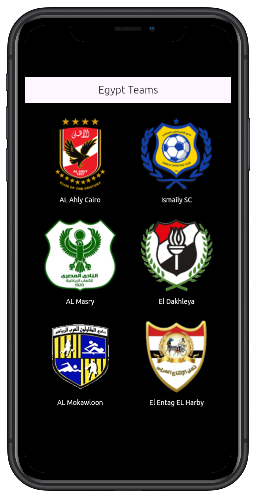

# Sample App With HTTP

- Using http to get data 
``` http.get( Uri.parse("https://v3.football.api-sports.io/teams?country=Egypt"))```

- Add header if we need 
```var headers = { 'x-rapidapi-key': 'xxxxxxxxxxxxxxxx','x-rapidapi-host': 'v3.football.api-sports.io'};```
``` var responce = await http.get( Uri.parse("https://v3.football.api-sports.io/teams?country=Egypt"),headers: headers);```

## now we get data in string format and we need to convert it to dart format to work with it 
#### First solution
- decode string to json 
```jsonDecode(responce.body)```
-convert json to object by 
    - create class for data
    ```class Team {int id; String name;Team({required this.id,required this.name,});}```

    -loop and pass json data to object 
    ``` for (int i = 1; i < jsonData['response'].length; i++) {final team = Team( id: jsonData['response'][i]['team']['id'], name: jsonData['response'][i]['team']['name'], );} ```

    


-----
---
---
##  App UI
